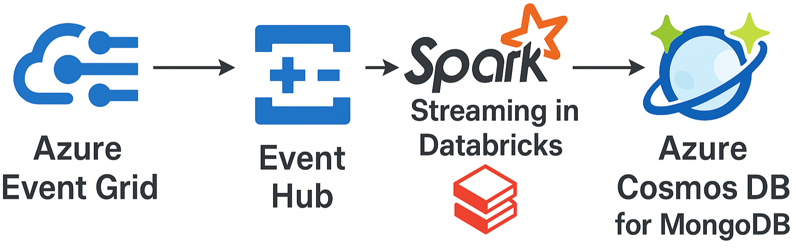

# Azure Event hubs Pipeline:

This project demonstrates an end-to-end event-driven architecture using **Azure Event Grid**, **Event Hub**, **Apache Spark Structured Streaming** in **Azure Databricks** and **Azure Cosmos DB for MongoDB**.

Here is the flow of data:

## Overview

Following steps were performed:

1. Created an **Azure Event Grid** Topic
2. Subscribed the topic to **Azure Event Hub**
3. Send sample events to **Event Grid** using curl command which gets passed on to **Azure Event Hub** after creating the connection
   <pre> bash curl -X POST https://TOPICNAME.REGION-1.eventgrid.azure.net/api/events \ -H "aeg-sas-key: YOURKEY" \ -H "Content-Type: application/json" \ -d '[ { "id": "1234", "eventType": "recordInserted", "subject": "/app/user/creation", "eventTime": "2025-04-24T10:00:00Z", "data": { "userId": "abc123", "userName": "johndoe" }, "dataVersion": "1.0" } ]' </pre>
4. Read and processed these events from **Azure event hub** in real-time using **Spark Streaming** inside **Azure Databricks**
5. Pushed these events in realtime to **Azure Cosmos DB for MongoDB**
